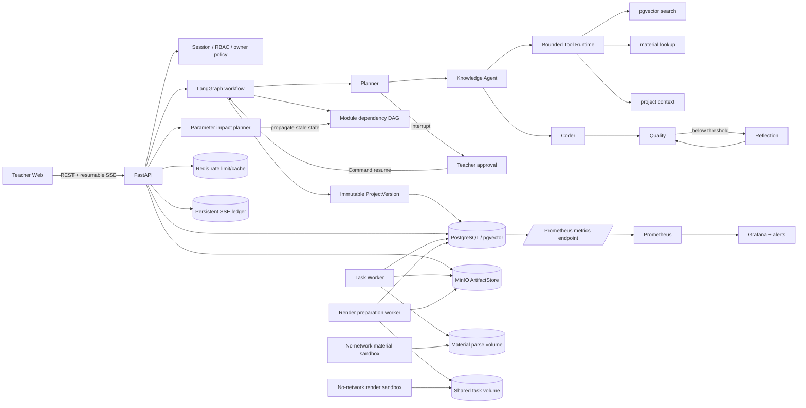
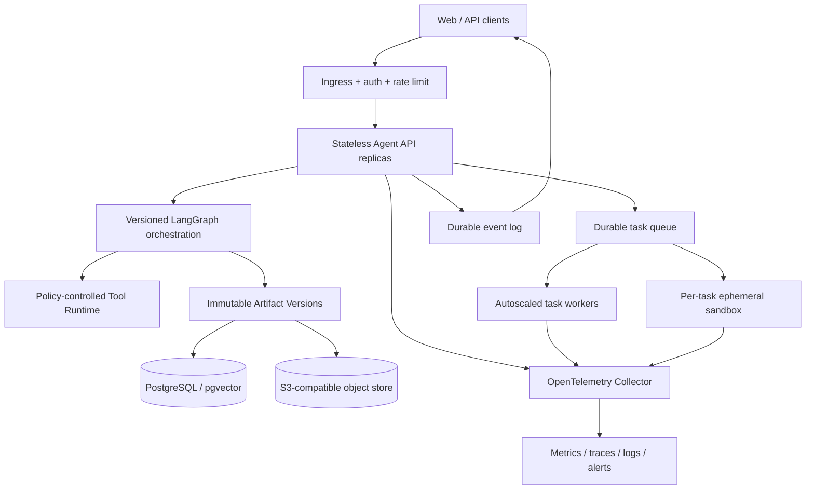
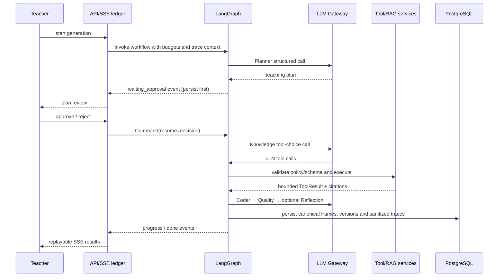

# EduFlow-Agent 架构

本文只描述当前代码可验证的实现，并将尚未落地的演进项单独标注。

## 当前运行架构

关键边界：

- 正常生成、HITL 恢复、反馈修订、局部重生成及单/批模块重试共用 LangGraph 节点实现；
- Modules 节点内部执行有界并发依赖 DAG，Graph 收尾是模块快照和版本的唯一写入点；
- Tool Runtime 只注册三个只读工具，模型参数不包含 actor、owner 或项目身份；
- Frames 表是活动 DSL 帧的读取真源，Project Snapshot 用于兼容字段和版本缓存；
- Project 以 `current_version_id` 指向不可变聚合快照；可变编辑清空指针形成 dirty working copy，
  工作流完成或显式保存时原子推进新版本；
- 参数依赖与模块 `requires` 共享跨产物影响图，结构性变更由 Frame 传播到 Video 等下游产物；
- 模型生成的 Manim Python 不在 API/带凭据 Worker 内执行；准备器签署脚本 SHA-256，
  无网络、无服务凭据的沙箱验签后才运行；
- 不可信 PDF/PPTX/文本也不在带凭据 Worker 内解析；Worker 只下载并签名，材料沙箱验签、
  解析并返回受 Schema 和大小约束的结果；
- SSE 事件先写 PostgreSQL 再发送，断线按事件游标重放，生产者以 lease 排他执行。

## 目标演进架构

尚未实现：每任务临时容器沙箱、OpenTelemetry Collector、长期指标后端以及 MCP/Skill 协议层。
`module_outputs.frames` 已迁移为不可变 ProjectVersion artifact reference，并由活动读路径按需
水合兼容投影；跨产物依赖图已用于影响预览和过期标记，但尚未按成本策略自动调度全部下游产物；
跨设备活动流发现已通过 owner 隔离的 SSE 账本查询入口实现。

## 一次 Agent 执行

设计决策见 [ADR 0001](adr/0001-renderscript-dsl.md)、[ADR 0002](adr/0002-unified-langgraph.md) 与 [ADR 0003](adr/0003-generated-code-isolation.md)。
